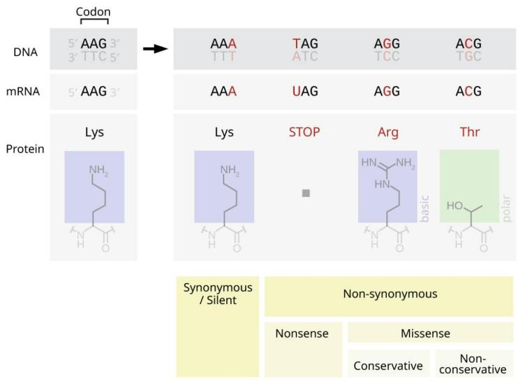
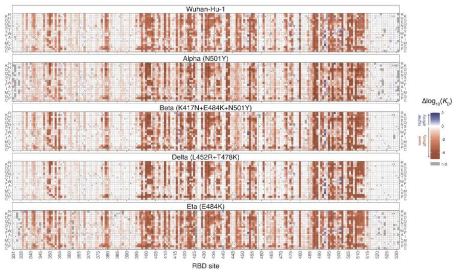
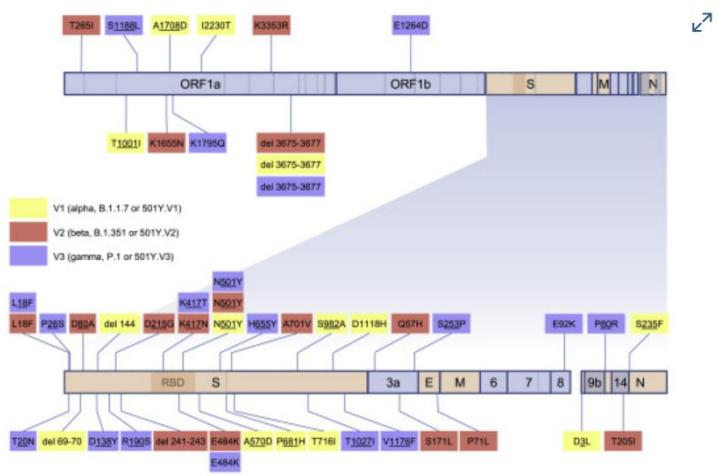
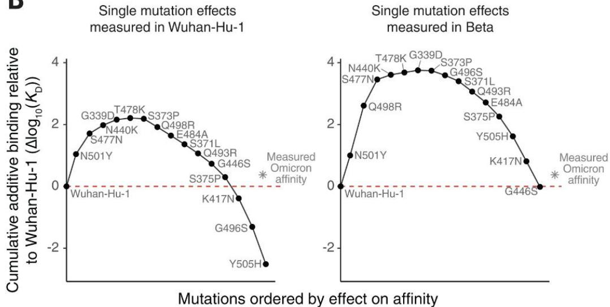
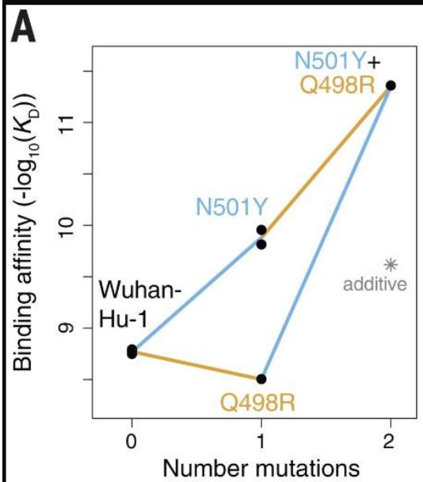

PPT1：引入：什么是点突变？

同学们好，今天我们来讲新冠病毒进化最基础、最核心的机制 ——点突变驱动的适应性进化。

点突变，就是病毒 RNA 在复制时，单个核苷酸发生替换，最终导致编码的氨基酸改变。它是 SARS-CoV-2 进化的基础驱动力，尤其集中在刺突蛋白受体结合域 RBD，这里承受着最强的正选择压力。



<details>
<summary>flowchart</summary>

```mermaid
graph TD
    A["Codon"] --> B["DNA: 5' AAG 3' TTC 5'"]
    B --> C["AAA TTT TAG ATC AGG TCC ACG TGC"]
    B --> D["AAA UAG AGG ACG"]
    E["Protein"] --> F["Lys: NH2-CH2-NH-C(=O)"]
    F --> G["Lys: NH2-CH2-NH-C(=O)"]
    G --> H["STOP: [■"]]
    H --> I["Arg: [HN-CH2-NH2-CH2-NH-C(=O)"]
    I --> J["basic"]
    J --> K["Thr: [HO-CH2-NH-C(=O)"]
    K --> L["polar"]]
    M["Synonymous / Silent"] --> N["Nonsense"]
    M --> O["Missense"]
    P["Conservative"] --> Q["Non-conservative"]
```
</details>

# PPT2：一、点突变的两大核心功能

点突变主要做两件事，直接决定病毒能不能传播、能不能逃避免疫：

1. 优化 ACE2 亲和力：让病毒更容易结合人体细胞受体。ACE2（血管紧张素转换酶 2）是一种广泛存在于人体细胞表面的跨膜蛋白，也是 SARS-CoV-2（新冠病毒）入侵人体细胞的关键受体  
2. 实现免疫逃逸：让抗体认不出来，突破疫苗与既往感染免疫



<details>
<summary>heatmap</summary>

| RBD site | Wuhan-Hu-1 | Alpha (N501Y) | Beta (K417N+E484K+N501Y) | Delta (L452R+T478K) | Eta (E484K) |
| -------- | ---------- | ------------- | ------------------------ | ------------------- | ----------- |
| 331      | -          | -             | -                        | -                   | -           |
| 340      | -          | -             | -                        | -                   | -           |
| 345      | -          | -             | -                        | -                   | -           |
| 350      | -          | -             | -                        | -                   | -           |
| 355      | -          | -             | -                        | -                   | -           |
| 360      | -          | -             | -                        | -                   | -           |
| 365      | -          | -             | -                        | -                   | -           |
| 370      | -          | -             | -                        | -                   | -           |
| 375      | -          | -             | -                        | -                   | -           |
| 380      | -          | -             | -                        | -                   | -           |
| 385      | -          | -             | -                        | -                   | -           |
| 390      | -          | -             | -                        | -                   | -           |
| 395      | -          | -             | -                        | -                   | -           |
| 400      | -          | -             | -                        | -                   | -           |
| 405      | -          | -             | -                        | -                   | -           |
| 410      | -          | -             | -                        | -                   | -           |
| 415      | -          | -             | -                        | -                   | -           |
| 420      | -          | -             | -                        | -                   | -           |
| 425      | -          | -             | -                        | -                   | -           |
| 430      | -          | -             | -                        | -                   | -           |
| 435      | -          | -             | -                        | -                   | -           |
| 440      | -          | -             | -                        | -                   | -           |
| 445      | -          | -             | -                        | -                   | -           |
| 450      | -          | -             | -                        | -                   | -           |
| 455      | -          | -             | -                        | -                   | -           |
| 460      | -          | -             | -                        | -                   | -           |
| 465      | -          | -             | -                        | -                   | -           |
| 470      | -          | -             | -                        | -                   | -           |
| 475      | -          | -             | -                        | -                   | -           |
| 480      | -          | -             | -                        | -                   | -           |
| 485      | -          | -             | -                        | -                   | -           |
| 490      | -          | -             | -                        | -                   | -           |
| 495      | -          | -             | -                        | -                   | -           |
| 500      | -          | -             | -                        | -                   | -           |
| 505      | -          | -             | -                        | -                   | -           |
| 510      | -          | -             | -                        | -                   | -           |
| 515      | -          | -             | -                        | -                   | -           |
| 520      | -          | -             | -                        | -                   | -           |
| 525      | -          | -             | -                        | -                   | -           |
| 530      | -          | -             | -                        | -                   | n.d.        |

The heatmap displays the Δlog₁₀(KD) values for different genetic variants (e.g., Alpha, Beta, Delta, Eta) across multiple RBD sites. The color scale ranges from n.d. to 2, indicating the magnitude of Δlog₁₀(KD). The color gradient from dark blue to dark red reflects the relative change in Δlog₁₀(KD).
</details>

Fig.1.Deep mutational scanning maps of ACE2-binding affnity forall single-aminoacid mutations in five SARS-CoV-2RBDvariants.   
图1.五种SARS-CoV-2刺突蛋白受体结合域变体所有单氨基酸突变的血管紧张素转换酶2结合亲和力深度突变扫描图谱

# PPT3：二、关键突变：N501Y 的趋同进化

最经典的例子就是 N501Y。

它在 Alpha、Beta、Gamma 三个不同谱系独立出现、反复发生，这叫趋同进化。

功能非常明确：把 RBD 与 ACE2 的亲和力提高 2.1–3.5 倍，显著增强入侵能力。

这就是自然选择最典型的证据：哪个突变有用，病毒就反复用哪个。



<details>
<summary>text_image</summary>

T265I S1188L A1708D I2230T K3353R E1264D
ORF1a ORF1b S M N
T1001I K1655K K1795Q del 3675-3677
del 3675-3677
del 3675-3677
V1 (alpha, B.1.1.7 or 501Y.V1)
V2 (beta, B.1.351 or 501Y.V2)
V3 (gamma, P.1 or 501Y.V3)
L18F L18F P28S D80A del 144 D213G K417N N501Y K417P N501Y H615Y A701V S982A D1118H Q57H S253P
RBD S 3a E M 6 7 8 9b 14 N
T20N del 69-70 D138Y R190S del 241-243 E484K A570D P681H T716I T1927I V1178F S171L P71L D3L T205I
E484K
</details>

Figure1SARs-Cov-2genomemapindicatingthe locationsandencodedaminoacidchanges ofwhatweconsideredhere tobe signature mutations of V1,V2,and V3 sequences   
图1新冠病毒基因组图谱，标注了本研究中认定的V1、V2和V3序列特征突变的位置及其编码的氨基酸变化

# PPT4：三、Omicron：从 “更强结合” 转向 “更强逃逸”

到了 Omicron，点突变策略发生关键转变：

不再一味追求更高 ACE2 亲和力，而是在维持结合的同时，优先选免疫逃逸突变。

比如：

. K417N   
E484A   
Q493R

这些突变不显著降低亲和力，但大幅改变抗原表位，躲开中和抗体。

B   


<details>
<summary>line</summary>

Single mutation effects measured in Wuhan-Hu-1 and Single mutation effects measured in Beta.
| Mutations ordered by effect on affinity | Wuhan-Hu-1 (Δlog₁₀(KD)) | Measured Omicron affinity (Δlog₁₀(KD)) |
| :--- | :--- | :--- |
| N501Y | 0.0 | 0.0 |
| S477N | 1.2 | 0.0 |
| G339D | 1.8 | 0.0 |
| T478K | 2.0 | 0.0 |
| N440K | 2.1 | 0.0 |
| S373P | 2.2 | 0.0 |
| Q498R | 1.6 | 0.0 |
| E484A | 1.4 | 0.0 |
| S371L | 1.2 | 0.0 |
| Q493R | 0.8 | 0.0 |
| G446S | -0.5 | 0.0 |
| K417N | -1.0 | 0.0 |
| G496S | -1.5 | 0.0 |
| Y505H | -2.5 | 0.0 |
| Measured Omicron affinity (left) vs. Measured Omicron affinity (right) (dashed red line).
</details>

（B）奥密克戎 BA.1 突变的亲和力缓冲效应。每个图展示了在武汉-Hu-1（左）或 Beta（右）

RBD 中测得的奥密克戎 BA.1 每个单 RBD 替换对 ACE2 结合亲和力[Δlog10(Kd)]的单独效应的累积叠加。即使背景中的参考状态不同，突变效应也按标注方向计算；例如，Beta 背景中的 N501Y 效应与测得的 Y501N 突变效应符号相反。红线表示武汉-Hu-1 的亲和力，星号表示奥密克戎 BA.1 RBD 相对于武汉-Hu-1 的实际亲和力

PPT5：四、免疫缺陷宿主：点突变的 “进化工厂”

综述里特别强调：免疫低下人群是病毒突变的重要来源。

比如 HIV 共感染、长期使用免疫抑制剂的患者，病毒可以在体内持续存活数月，进化速率比普通感染快得多，积累大量突变。

这些人相当于病毒的体内进化温床，源源不断产生新突变，最终扩散到人群，形成新变异株。

PPT6：五、上位性效应：突变不是单打独斗

点突变还有一个高级玩法：上位性（epistasis）。

意思是：一个突变的效果，依赖其他突变的背景。

比如 Q493E 这个突变，在早期毒株里作用很小，但在 Omicron 背景下，能大幅增强免疫逃逸。

多个突变组合起来，实现 1+1>2 的效果，这是 Omicron 如此成功的关键之一。



<details>
<summary>line</summary>

| Number mutations | Binding affinity (-log₁₀(KD)) |
| ---------------- | ----------------------------- |
| Wuhan-Hu-1       | 8.5                           |
| N501Y            | 9.8                           |
| Q498R            | 8.2                           |
| N501Y+Q498R      | 11.5                          |
</details>

（A）双突变循环图，展示 N501Y 与 Q498R 之

间的正上位相互作用。星号表示假设加性效应时预期的双突变结合亲和力

回到 PPT4，Omicron 这么多突变加起来，在原始株背景下亲和力会掉到很低，但在有 N501Y的 Beta 背景下就能维持正常亲和力，这就是上位性效应带来的 “亲和力缓冲”

PPT7：总结：点突变的核心地位

最后做个小结：

1. 点突变是新冠进化的基础引擎  
2. RBD 是热点区域，负责入侵 + 逃逸  
3. N501Y 是趋同进化典范  
4. Omicron 靠突变组合实现高效逃逸

5. 免疫缺陷宿主加速突变产生  
6. 上位性让病毒进化更灵活