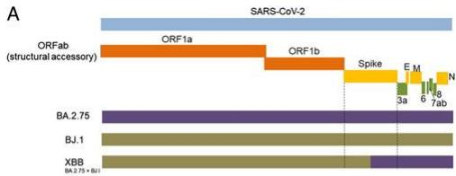
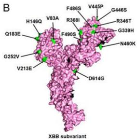
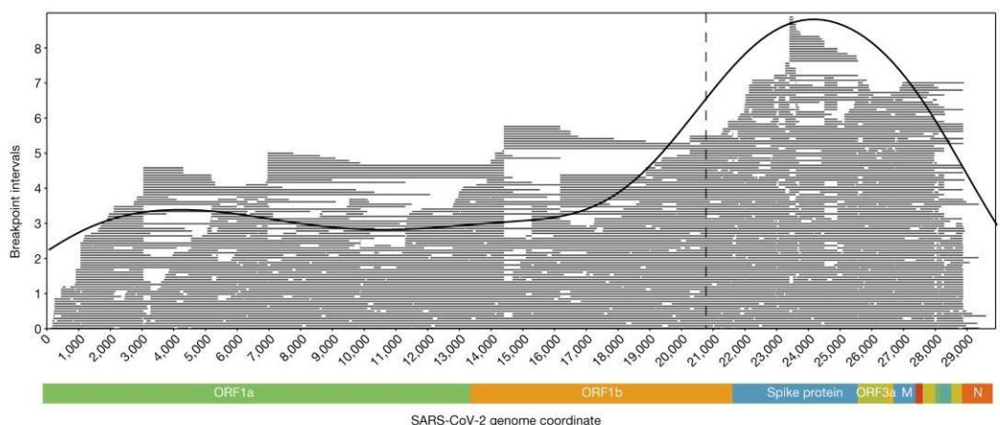
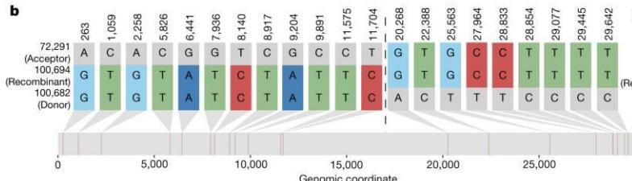
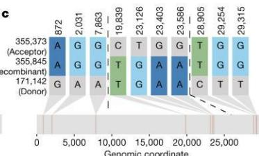
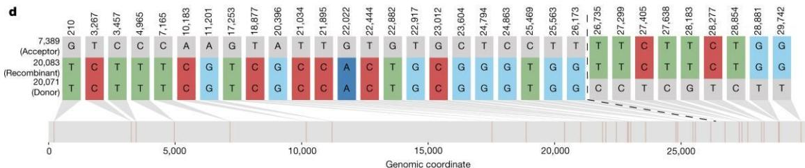

# 逐字稿

我接下来将介绍病毒分子进化机制中的一个关键过程——重组。

SARS-CoV-2 是一种 RNA 病毒，它的重组并不是我们在真核生物中熟悉的染色体重组，而是一种发生在复制过程中的模板切换。

具体来说，当两个不同病毒谱系同时感染同一个宿主细胞时，病毒的 RNA依赖RNA聚合酶 会在复制 RNA 的过程中，从一个模板“跳跃”到另一个模板上继续复制。最终，就会形成一个由不同来源片段拼接而成的“嵌合基因组”。

这个过程有时也被称为 copy-choice 机制，本质上并不是基因交换，而是复制过程中的“轨道切换”。

为了更好理解这种机制，我们可以做一个简单对比。

在真核生物中，重组通常发生在减数分裂过程中，涉及同源染色体的配对和片段交换，是一种结构化、受控的遗传过程。

而在原核生物中，比如细菌，重组通常通过转化、接合或转导实现，本质上是细胞之间的基因流动，依赖外源 DNA 或质粒。

相比之下，SARS-CoV-2 的重组既不依赖染色体配对，也不依赖外源 DNA 的摄取，而是发生在病毒 RNA 复制瞬间的一次“模板跳跃”。这体现了病毒进化机制的高度简化和高效。

而SARS-CoV-2 的模板切换之所以能够高效发生，是因为 RdRp 与 RNA 结合相对不稳定，在共感染条件下周围存在大量相似模板，同时 RNA 的序列同源性和二级结构为重新配对提供了条件。再加上冠状病毒本身具有跳跃式转录机制，使得这种‘换轨复制’不仅可能，而且高效，具有选择性。

接下来我们看一个非常典型的例子，也就是 Omicron 时代的重要重组谱系——XBB。

研究表明，XBB 是由两个 BA.2 亚谱系，BJ.1 和 BM.1.1.1，通过重组产生的。它的重组断点位于刺突蛋白的受体结合域，也就是 Spike RBD 区域。

这个位置非常关键，因为它直接决定病毒与宿主细胞受体的结合能力，同时也是中和抗体的主要作用靶点。

因此，XBB 的不同基因片段组合在一起，使它同时具备更强的免疫逃逸能力和一定程度的传播优势。这种“功能叠加”，正是重组最重要的进化意义之一。

从更宏观的角度来看，在 Omicron 流行阶段，病毒的进化并不是单一机制驱动的，而是多种机制共同作用的结果，包括抗原漂移、趋同进化，以及我们这里重点讨论的重组。

大规模系统发育研究显示，在 160 万条病毒基因组序列中，已经检测到589 个重组事件，约2.7 % 的序列具有可识别的重组祖先。

更有意思的是，这些重组断点并不是随机分布的，而是明显集中在病毒基因组的 3’端区域，尤其是 Spike 基因附近。这说明重组在功能上可能受到选择压力的影响。

那么，为什么重组对 Omicron 尤其重要？

原因在于，突变通常是逐步积累的，而重组可以在一次事件中，将多个已经存在的有利突变组合到一起，从而显著加快进化速度。

换句话说，重组相当于一种“进化加速器”，使病毒能够更快适应宿主免疫系统的压力。

最后，我用一句话总结这一部分内容：

真核生物的重组，是染色体层面的遗传重排；原核生物的重组，是细胞之间的基因流动；而 SARS-CoV-2 的重组，是复制过程中发生的模板切换。

它的独特之处在于，可以在一次事件中整合多个有利突变，从而帮助 Omicron 亚型快速获得免疫逃逸和传播优势。

# Slide1：什么是病毒重组

SARS-CoV-2 是一种 RNA 病毒，它的重组并不是我们在真核生物中熟悉的染色体重组，而是一种发生在复制过程中的模板切换。

（机制演示）

# Slide2：与真核生物不同

在真核生物中，重组通常发生在减数分裂过程中，涉及同源染色体的配对和片段交换，是一种结构化、受控的遗传过程。

# Slide3：与原核生物不同

而在原核生物中，比如细菌，重组通常通过转化、接合或转导实现，本质上是细胞之间的基因流动，依赖外源 DNA 或质粒。

# Slide4：对比总结

相比之下，SARS-CoV-2 的重组既不依赖染色体配对，也不依赖外源 DNA 的摄取，而是发生在病毒 RNA 复制瞬间的一次“模板跳跃”。这体现了病毒进化机制的高度简化和高效。

（来3个动画，分别演示三种生物的遗传物质重组事件，进行直观对比）

# Slide5：机制

而 SARS-CoV-2 的模板切换之所以能够高效发生，是因为 RdRp 与 RNA 结合相对不稳定，在共感染条件下周围存在大量相似模板，同时 RNA 的序列同源性和二级结构为重新配对提供了条件。再加上冠状病毒本身具有跳跃式转录机制，使得这种‘换轨复制’不仅可能，而且高效，具有选择性。

（动画展现机理）

# Slide6：Omicron 例子：XBB

XBB 是很好的案例：研究显示它由两个共流行的 BA.2 系谱 BJ.1 和 BM.1.1.1 重组产生，断点位于 Spike RBD 区域；其不同片段共同增强免疫逃逸和细胞融合能力。

text_image

SARS-CoV-2
ORFab
(structural accessory)
ORF1a
ORF1b
Spike
E M N
3a 6 7ab
BA.2.75
BJ.1
XBB
BA.2.75 + BJ

chemical

3D protein structure of an XBB subunit with labeled amino acid residues and green ligand binding sites

上方展示基因组，下方展示重组  
Slide7：为什么重组的频率

Omicron 时代，重组、抗原漂移、趋同进化共同推动 SARS-CoV-2 改变抗原性。大规模系统发育研究还在 160 万条序列中识别出 589 个重组事件，约 2.7% 测序基因组有可检测重组祖先，且刺突基因区域存在重组频率峰值。

a   

line

| SARS-CoV-2 genome coordinate | Breakpoint intervals |
| ----------------------------- | -------------------- |
| 1,000                         | 2.5                  |
| 2,000                         | 3.0                  |
| 3,000                         | 3.5                  |
| 4,000                         | 3.5                  |
| 5,000                         | 3.5                  |
| 6,000                         | 3.5                  |
| 7,000                         | 3.5                  |
| 8,000                         | 3.5                  |
| 9,000                         | 3.5                  |
| 10,000                        | 3.5                  |
| 11,000                        | 3.5                  |
| 12,000                        | 3.5                  |
| 13,000                        | 3.5                  |
| 14,000                        | 3.5                  |
| 15,000                        | 3.5                  |
| 16,000                        | 3.5                  |
| 17,000                        | 3.5                  |
| 18,000                        | 4.0                  |
| 19,000                        | 4.5                  |
| 20,000                        | 5.5                  |
| 21,000                        | 6.5                  |
| 22,000                        | 7.5                  |
| 23,000                        | 8.5                  |
| 24,000                        | 8.5                  |
| 25,000                        | 8.5                  |
| 26,000                        | 8.5                  |
| 27,000                        | 7.5                  |
| 28,000                        | 6.5                  |
| 29,000                        | 5.5                  |

heatmap

| Genomic coordinate | 0 | 5,000 | 10,000 | 15,000 | 20,000 | 25,000 |
|---|---|---|---|---|---|---|
| 355,373 (Acceptor) | A | G | G | G | A | T |
| 355,845 (Recombinant) | A | G | G | G | A | T |
| Donor | G | A | A | T | A | C |
| 872 | | | | | | |
| 2,031 | | | | | | |
| 7,863 | | | | | | |
| 19,839 | | | C | T | G | G |
| 23,126 | | | G | G | G | T |
| 23,403 | | | A | G | A | T |
| 23,586 | | | A | G | A | T |
| 28,905 | | | T | G | G | T |
| 29,254 | | | G | G | G | T |
| 29,315 | | | T | T | T | T |

Legend:
| Category (Acceptor) / Recombinant (Donor) |
|---|
| 355,373 (Acceptor) |
| 355,845 (Recombinant) |
| 171,142 (Donor) |
Genomic coordinate: 0 to 25,000.

bar_stacked

| Genomic | 7,389 (Acceptor) | 20,083 (Recombinant) | 20,071 (Donor) |
|---|---|---|---|
| 210 | G | T | C |
| 3,267 | T | C | T |
| 3,457 | C | T | T |
| 4,965 | C | T | T |
| 7,165 | C | A | T |
| 10,183 | A | G | T |
| 11,201 | A | G | T |
| 17,253 | G | T | C |
| 18,877 | T | A | G |
| 20,396 | T | C | G |
| 21,034 | T | C | C |
| 21,895 | A | C | G |
| 22,022 | A | C | G |
| 22,444 | G | T | C |
| 22,882 | G | T | G |
| 22,917 | G | C | G |
| 23,012 | C | G | G |
| 23,604 | C | G | G |
| 24,794 | G | G | G |
| 24,863 | G | T | G |
| 25,469 | C | G | G |
| 25,563 | C | T | G |
| 26,173 | T | G | G |
| 26,735 | T | C | C |
| 27,299 | T | C | T |
| 27,405 | C | T | C |
| 27,638 | T | T | C |
| 28,183 | C | T | C |
| 28,277 | T | C | G |
| 28,854 | T | G | T |
| 28,881 | G | T | C |
| 29,742 | G | T | T |
Genomic coordinate axis: 0 to 25,000.

Slide8：重组对于病毒进化的重要性

真核重组是染色体层面的遗传重排，原核重组是细胞间基因流动，而 SARS-CoV-2 重组是病毒复制中的模板切换；它能在一次事件中整合多个有利突变，因此可使 Omicron

亚型快速获得免疫逃逸和传播优势。